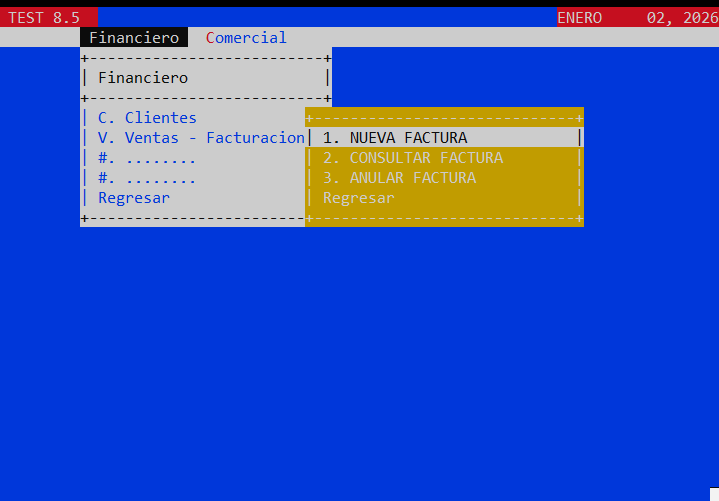
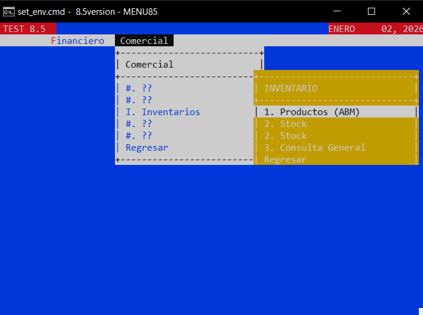
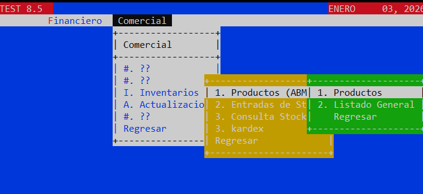

🚀 Proyecto COBOL - Versión 8.5
Repositorio de gestión y desarrollo en GnuCOBOL. Este proyecto implementa una arquitectura modular enfocada en CRUD, manejo de archivos indexados y pantallas interactivas.
```
cobc -x -free SRC\MENU85.cbl -I CPY -I FD -I FILES\SEL

cobc -m -free SRC\FINCLI01.cbl -I CPY -I FD -I FILES\SEL -o mod\FINCLI01.dll & rem CLIENTES
cobc -m -free SRC\FINCLI02.cbl -I CPY -I FD -I FILES\SEL -o mod\FINCLI02.dll & rem LISTADO CLIENTES
cobc -m -free SRC\VENFAC01.cbl -I CPY -I FD -I FILES\SEL -o mod\VENFAC01.dll & rem FACTURAS
cobc -m -free SRC\INVPRO01.cbl -I CPY -I FD -I FILES\SEL -o mod\INVPRO01.dll & rem PRODUCTOS
cobc -m -free SRC\INVPRO02.cbl -I CPY -I FD -I FILES\SEL -o mod\INVPRO02.dll & rem LISTADO PRODUCTOS
cobc -m -free SRC\INVBOD01.cbl -I CPY -I FD -I FILES\SEL -o mod\INVBOD01.dll & rem BODEGAS
cobc -m -free SRC\INVBOD02.cbl -I CPY -I FD -I FILES\SEL -o mod\INVBOD02.dll & rem LISTADO BODEGAS
cobc -m -free SRC\INVSTK01.cbl -I CPY -I FD -I FILES\SEL -o mod\INVSTK01.dll & rem LISTADO STOCK
cobc -m -free SRC\INVSTK02.cbl -I CPY -I FD -I FILES\SEL -o mod\INVSTK02.dll & rem LISTADO STOCK
MENU85
 
```
cobc -x -free SRC\MENU85.cbl -I CPY -I FD -I FILES\SEL -o bin\MENU85.exe

Cuando domines CRUD:

🔹 Archivos con llaves alternas
🔹 Control de concurrencia (LOCK)
🔹 Pantallas formateadas (LINE/COL)
🔹 Modularización (CALL)
🔹 Logs de errores

🔜 FASES
 - FASE 3: Clientes + Ventas + Factura
1️⃣ Diseñar las validaciones correctas (nivel empresa real)
2️⃣ Ordenar el flujo lógico del inventario
3️⃣ Hacer un mapa completo del proyecto para que lo entiendas todo
4️⃣ Simular una entrevista técnica con lo que ya sabes







### CUANDO LA ESRTUCUTURA NO ESTA DEFINIDA (ANTERIORMENTE) 
``` 
cobc -x -free MENU85.cbl CLIENTES-PROGRAM.cbl CLIENTES.cbl LISTADO.cbl -o sistema.exec
```
```
*> 1. Compila los subprogramas como módulos dinámicos
*> 2. Compila el menú como el ejecutable principal
cobc -m -free PROGRAM.cbl CLIENTES.cbl
cobc -x -free MENU.cbl -o sistema.exe
```

### ARCHIVOS COBOL
.CPY	
.FD	
.SEL

- ORDEN CORRECTO
   
<details open>
  <summary><b>📁 8.5version (Proyecto COBOL)</b></summary>
  <br>

  <details>
    <summary>📂 <b>CPY/</b> - Copybooks (Código reutilizable)</summary>
    <ul>
      <li><code>CLIENTES-FD.CPY</code></li>
      <li><code>UTILIDADES.CPY</code></li>
      <li><code>OTRO-UTIL.CPY</code></li>
    </ul>
  </details>

  <details>
    <summary>📂 <b>FD/</b> - File Descriptions reales</summary>
    <ul>
      <li><code>CLIENTES.FD</code></li>
    </ul>
  </details>

  <details>
    <summary>📂 <b>BIN/</b> - Ejecutables y Datos</summary>
    <details style="margin-left: 20px;">
      <summary>📁 <b>DAT/</b> - Archivos indexados/binarios</summary>
      <ul><li><code>CLIENTES.DAT</code></li></ul>
    </details>
  </details>

  <details>
    <summary>📂 <b>FILES/</b> - Archivos secuenciales</summary>
    <ul>
      <li><code>CLIENTES.TXT</code></li>
      <li><code>CLIENTES.CSV</code></li>
    </ul>
    <details style="margin-left: 20px;">
      <summary>📁 <b>SEL/</b> - Archivos de selección/control</summary>
      <ul><li><code>CLIENTES.SEL</code></li></ul>
    </details>
  </details>
  <details>
    <summary>📂 <b>mod/</b> - Archivos dll</summary> 
  <details>
    <summary>📂 <b>SRC/</b> - Programas COBOL (.cob, .cbl)</summary>
    <ul>
      <li><code>PROGRAMA1.COB</code></li>
      <li><code>PROGRAMA2.COB</code></li>
      <li><code>MENU.COB</code></li>
    </ul>
  </details>

  <details>
    <summary>📂 <b>LIB/</b> - Librerías externas</summary>
    <ul>
      <li><code>LIBUTIL.CPY</code></li>
    </ul>
  </details>

</details>

- CLIENTES.DAT   ← datos reales (persisten)
- CLIENTES.FD    ← definición lógica (estructura - TABLA)
- CLIENTES.SEL   ← cómo se accede
- CLIENTES.CPY   ← copia reutilizable de estructuras

 
|              FLUJO PRINCIPAL (MAIN)              |
|--------------------------------------------------|
|                                                  |
|  MAIN                                            |
|   ├─ Inicializa entorno (Variables y Pantalla)   |
|   ├─ Abre archivos (OPEN I-O / INPUT)            |
|   ├─ LOOP PRINCIPAL                              |
|   |   ├─ Muestra pantalla (DISPLAY SCREEN)       |
|   |   ├─ Carga datos (READ / ACCEPT)             |
|   |   └─ Navega (EVALUATE TECLAS)                |
|   └─ Cierra archivos (CLOSE)                     |
|                                                  |
 


:: por jose daniel JDGO en GnuCOBOL / Windows
set COB_SCREEN_EXCEPTIONS=Y
set COB_COPY_DIR=C:\GC32\cobol\CPY

:: new cmd to stay open if not started directly from cmd.exe window


| Color	Código |
|--------------|
|   Negro	 0 |
|   Azul	 1 |
|   Verde	 2 |
|   Cian	 3 |
|   Rojo	 4 |
|   Magenta	 5 |
|   Amarillo 6 |
|   Blanco	 7 | 

- EJEMPLOS DE COPYBOOKS (.CPY)
   78 COLOR-ROJO  VALUE 4.
   

- CODIGOS DE TECLAS (GnuCOBOL / Windows)
    78 TECLA-ENTER      VALUE 0.
    78 TECLA-ARRIBA     VALUE 2003.
    78 TECLA-ABAJO      VALUE 2004.
    78 TECLA-ESC        VALUE 2005.
    78 TECLA-DERECHA    VALUE 2002.

(POSIBLE-PROBAR)
F1	1001 
F2	1002

*HABILITAR TECLAS*
```
           SET ENVIRONMENT "COB_SCREEN_EXCEPTIONS" TO "Y".
           SET ENVIRONMENT "COB_SCREEN_ESC"        TO "Y". *> Agrega esta línea específica
```
| Código | ✅ Estados “normales” (NO error)   |
| ------ | ----------------------------------- |
| `"00"` | Operación exitosa                   |
| `"02"` | Registro duplicado (según contexto) |
| `"04"` | Operación parcial                   |
| `"05"` | Archivo opcional no existe          |
| `"07"` | Fin de datos / condición esperada   |


| Código |❌Estados de ERROR REAL              |
| ------ | ------------------------------------|
| `"10"` | Fin de archivo (EOF)                |
| `"21"` | Registro no encontrado              |
| `"23"` | Clave inválida                      |
| `"30"` | Archivo no es el que se espera      |
| `"35"` | Archivo no existe                   |
| `"39"` | Archivo incompatible                |
| `"41"` | Archivo ya abierto                  |
| `"46"` | Archivo bloqueado                   |

```
PRODUCTOS  1 ──────┐
                   ├── STOCK
BODEGAS    1 ──────┘
```
### GnuCOBOL install step by step
https://sourceforge.net/p/gnucobol/discussion/help/thread/9676cf4adf/a03a/
- Download zip and extract here : C:\GC32
- create a folder called cobol
- create acces direct to desk of set_env.cmd
- enronment variable w10: system variables - path: C:\GnuCOBOL\bin
- edit set_env.cmd and set:
  :: por jose daniel JDGO
  set COB_SCREEN_EXCEPTIONS=Y
  set COB_SCREEN_ESC=Y
  set COB_COPY_DIR=C:\GC32\cobol\CPY
  set COB_LIBRARY_PATH=mod

  ## *MAINFRAME AS/400*
  C:/mvs/mvs → TN3270 → 
  ________________________________________________________________________________
- https://github.com/actualquak/tk4 instead of http://wotho.ethz.ch/tk4-/
- Extrae todo el contenido en C:/mvs del archivo descargado y crea la capeta /logs para que funcione 
- C:/mvs/mvs
  - - - - - - - - - - - - - - - - - - - - - - - - - - - - - - - - - - - - - - - - - - - - - - - - - 

- https://sourceforge.net/projects/x3270/
  #### Ubicacion de Standar division:
- C:\ProgramData\Microsoft\Windows\Start Menu\Programs\Vista TN3270
- localhost o 127.0.0.0.1
- port: 3227
  ###### Credentials
  - herc01
  - cul8tr
  - - - - - - - - - - - - - - - - - - - - - - - - - - - - - - - - - - - - - - - - - - - - - - - - - 
  Cancel proccess
  - /c u=HERC01
- https://www.tombrennansoftware.com/v200/
------------------------------------------------------------

